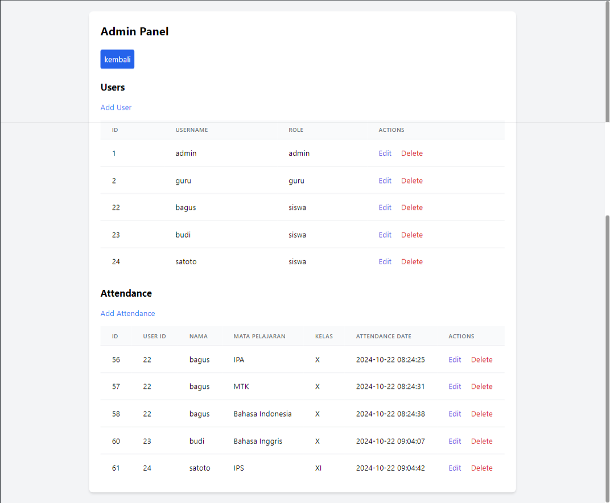
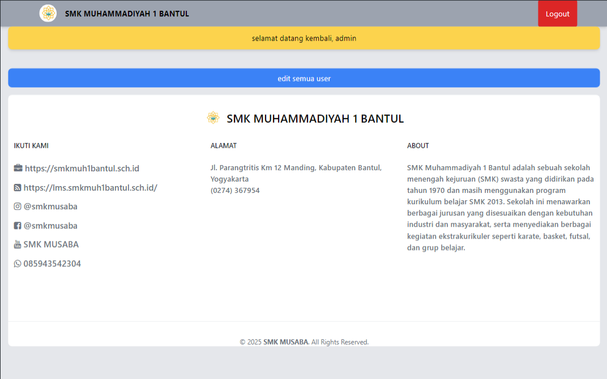
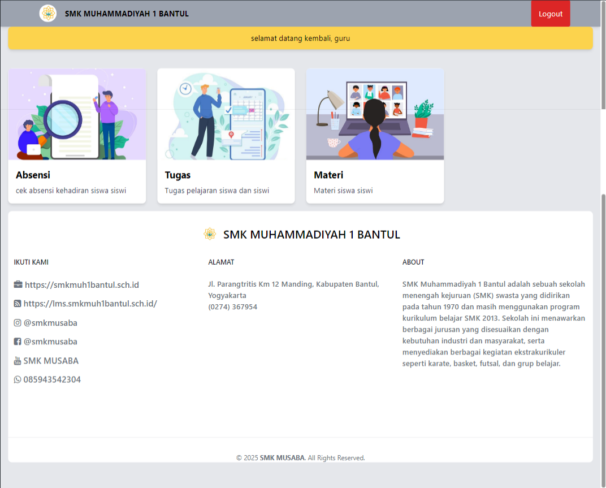
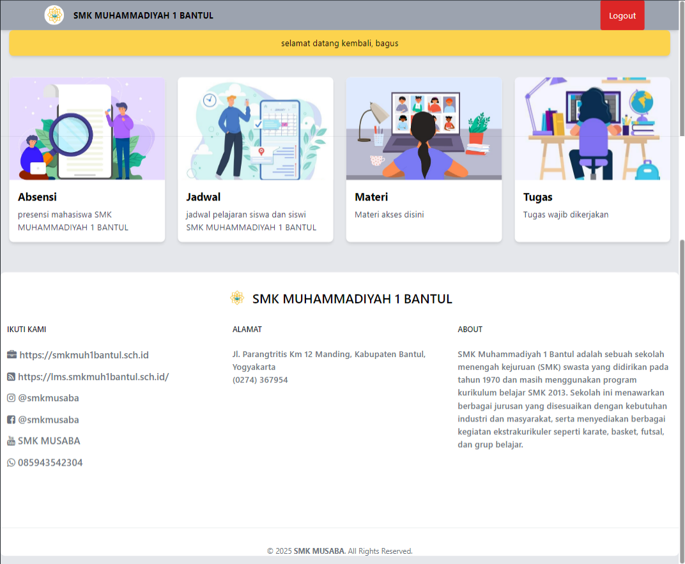

<h1 align="center">E-LEARNING SMK MUSABA</h1>

<!-- Garis Lurus -->
 
<!-- End -->


<!-- Garis Lurus -->
 
<!-- End -->

 ## ✅ About 

> e-Learning SMK Muhammadiyah 1 Bantul (Musaba) is an online learning platform designed to support the teaching and learning process at SMK Muhammadiyah 1 Bantul. This platform allows students to access learning materials, assignments, and various other learning resources online. With the presence of e-Learning, students can learn more flexibly and efficiently without being limited by time and place.

> This platform offers various features that facilitate the learning process. First, there is a virtual classroom feature that enables students and teachers to interact directly through video conferencing. In the virtual classroom, teachers can explain the material, answer students' questions, and even assign tasks in real-time. Additionally, the platform provides a discussion forum where students can discuss learning materials, exchange ideas, and solve problems together.

> The e-Learning system also simplifies communication between teachers and students. Through this platform, students can send messages to teachers, seek assistance, or ask questions related to the learning material. On the other hand, teachers can provide direct feedback to students, offer suggestions, and motivate students to continue learning.


<!-- Garis Lurus -->
 
<!-- End -->

## 👦🏽 Who created this application?

| Profile        |  Information                      |
|----------------|----------------------------------|
| Name           | Bagus Budi Satoto                |
| Major        | Bachelor of Informatics                |
| Campus         |  University Amikom  Yogyakarta    |

<!-- Garis Lurus -->
 
<!-- End -->

## 📊 Languages and Tools
<br>

- [HTML](https://developer.mozilla.org/en-US/docs/Web/HTML)

- [CSS](https://developer.mozilla.org/en-US/docs/Web/CSS)

- [Javascript](https://developer.mozilla.org/en-US/docs/Web/JavaScript)

- [PHP](https://www.php.net/docs.php)

- [Hack](https://docs.hhvm.com/hack/modules/introduction)

- [Git](https://git-scm.com/)

- [vs-code](https://code.visualstudio.com/)


<!-- Garis Lurus -->
 
<!-- End -->

## 🔗 How to Install
<br>

- <code>git clone ↆↆ </code>
  
  ```bash
  git clone https://github.com/bagussatoto/e-learning-SMK-Musaba
  ``` 
  
- <code>cd e-learning</code>
- <code>npm install</code>
- <code>npm run dev</code>

<!-- Garis Lurus -->
 
<!-- End -->


- Open ``XAMPP.``

- Create a database named ``learning``.

- Import the SQL file into the ``learning`` database.

- Move the "public" folder to ``htdocs`` (preferably into a folder with a name of your choice).

- Once you've imported the SQL file and moved the ``public`` folder to ``htdocs,``  enter the URL in your browser as: ``localhost/e-learning``.


## 📷 Screenshot

## Panel Admin


## Dasboard admin


## Dasboard guru


## Dasboard siswa



<!-- Garis Lurus -->
 
<!-- End -->


## 📌 New Feature Request and Bug Report

You can request new features or report bugs through the [**issues**](https://github.com/bagussatoto/e-learning-SMK-Musaba/issues) menu provided by GitHub (see menu above), post new issues and we will discuss there. 


<!-- Garis Lurus -->
 
<!-- End -->

> 🧑🏽‍💻 | [BAGUS BUDI SATOTO ](http://github.com/bagussatoto)
<br>


