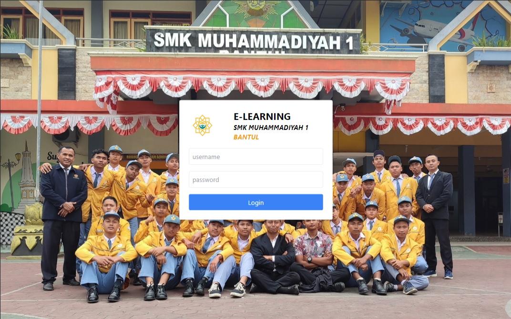

<h1 align="center">E-LEARNING SMK MUSABA</h1>

<!-- Garis Lurus -->
 
<!-- End -->


<!-- Garis Lurus -->
 
<!-- End -->

 ## ✅ About 

    e-Learning SMK Muhammadiyah 1 Bantul (Musaba) adalah sebuah platform pembelajaran daring yang dirancang untuk mendukung proses belajar mengajar di SMK Muhammadiyah 1 Bantul. Platform ini memungkinkan siswa untuk mengakses materi pelajaran, tugas, dan berbagai sumber belajar lainnya secara online. Dengan adanya e-Learning, siswa dapat belajar dengan lebih fleksibel dan efisien tanpa terbatas oleh waktu dan tempat.

    Platform ini menawarkan berbagai fitur yang memudahkan proses pembelajaran. Pertama, terdapat fitur kelas virtual yang memungkinkan siswa dan guru berinteraksi secara langsung melalui video konferensi. Dalam kelas virtual ini, guru dapat memberikan penjelasan materi, menjawab pertanyaan siswa, dan bahkan memberikan tugas secara real-time. Selain itu, platform ini juga menyediakan forum diskusi di mana siswa dapat berdiskusi tentang materi pelajaran, bertukar ide, dan memecahkan masalah bersama-sama.

    Sistem e-Learning ini juga mempermudah komunikasi antara guru dan siswa. Melalui platform ini, siswa dapat mengirim pesan kepada guru, meminta bantuan, atau mengajukan pertanyaan terkait materi pelajaran. Di sisi lain, guru dapat memberikan umpan balik langsung kepada siswa, memberikan saran, dan memotivasi siswa untuk terus belajar.


<!-- Garis Lurus -->
 
<!-- End -->

## 👦🏽 Who created this application?

| Profile        |  Information                      |
|----------------|----------------------------------|
| Name           | Bagus Budi Satoto                |
| Major        | Bachelor of Informatics                |
| Campus         |  University Amikom  Yogyakarta    |

<!-- Garis Lurus -->
 
<!-- End -->

## 📊 Languages and Tools
<br>

- [HTML](https://developer.mozilla.org/en-US/docs/Web/HTML)

- [CSS](https://developer.mozilla.org/en-US/docs/Web/CSS)

- [Javascript](https://developer.mozilla.org/en-US/docs/Web/JavaScript)

- [Git](https://git-scm.com/)

- [vs-code](https://code.visualstudio.com/)


<!-- Garis Lurus -->
 
<!-- End -->

## 🔗 How to Install
<br>

- <code>git clone ↆↆ </code>
  
  ```bash
  git clone https://github.com/bagussatoto/e-learning-SMK-Musaba
  ``` 
  
- <code>cd e-learning</code>
- <code>npm install</code>
- <code>npm run dev</code>

<!-- Garis Lurus -->
 
<!-- End -->


- Open ``XAMPP.``

- Create a database named ``learning``.

- Import the SQL file into the ``learning`` database.

- Move the "public" folder to ``htdocs`` (preferably into a folder with a name of your choice).

- Once you've imported the SQL file and moved the ``public`` folder to ``htdocs,``  enter the URL in your browser as: ``localhost/e-learning``.


## Screenshot

## 


<!-- Garis Lurus -->
 
<!-- End -->


## 📌 New Feature Request and Bug Report

You can request new features or report bugs through the [**issues**](https://github.com/bagussatoto/e-learning-SMK-Musaba/issues) menu provided by GitHub (see menu above), post new issues and we will discuss there. 


<!-- Garis Lurus -->
 
<!-- End -->

> 🧑🏽‍💻 | [BAGUS BUDI SATOTO ](http://github.com/bagussatoto)
<br>


